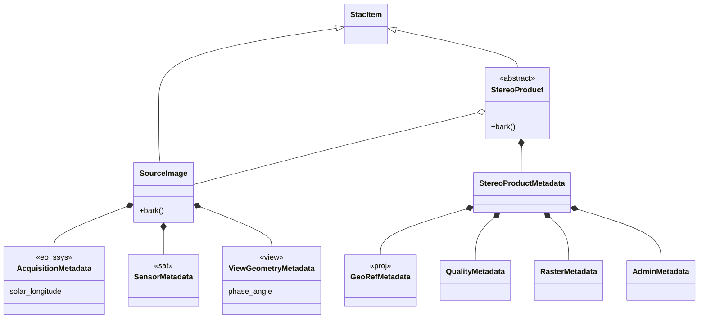

```mermaid
classDiagram
    class StacItem {
    }
    class SourceImage {
        +bark()
    }
    class AcquisitionMetadata <<eo_ssys>> {
      solar_longitude
    }
    class SensorMetadata <<sat>> {
    }
    class ViewGeometryMetadata <<view>> {
      phase_angle
    }
    class StereoProduct <<abstract>> {
        +bark()
    }
    class StereoProductMetadata {
    }
    class GeoRefMetadata <<proj>> {
    }
    class QualityMetadata {
    }
    class RasterMetadata {
    }
    class AdminMetadata {
    }
    StacItem <|-- StereoProduct
    StacItem <|-- SourceImage
    StereoProduct o-- SourceImage
    StereoProduct *-- StereoProductMetadata
    StereoProductMetadata *-- GeoRefMetadata
    StereoProductMetadata *-- QualityMetadata
    StereoProductMetadata *-- RasterMetadata
    StereoProductMetadata *-- AdminMetadata
    SourceImage *-- AcquisitionMetadata
    SourceImage *-- SensorMetadata
    SourceImage *-- ViewGeometryMetadata

```
